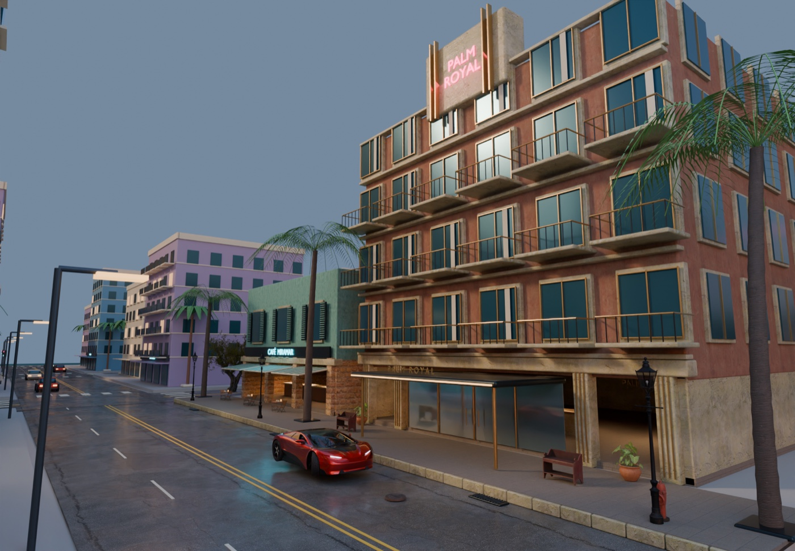
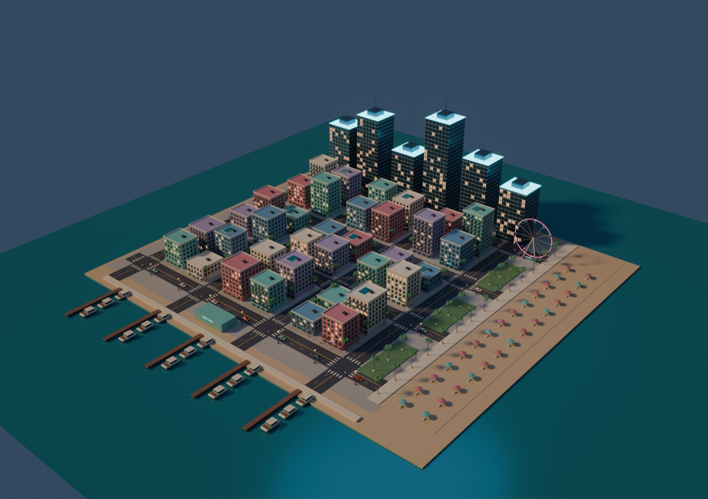
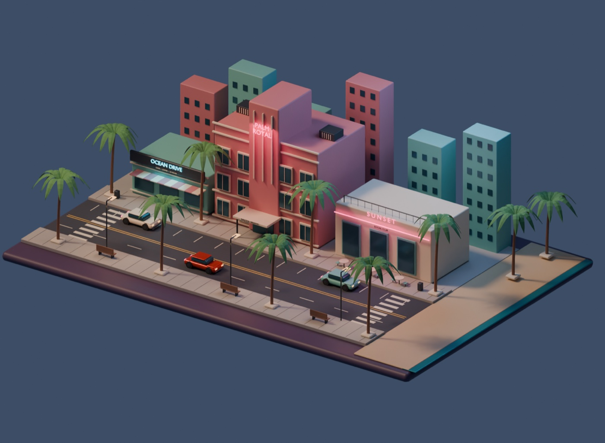
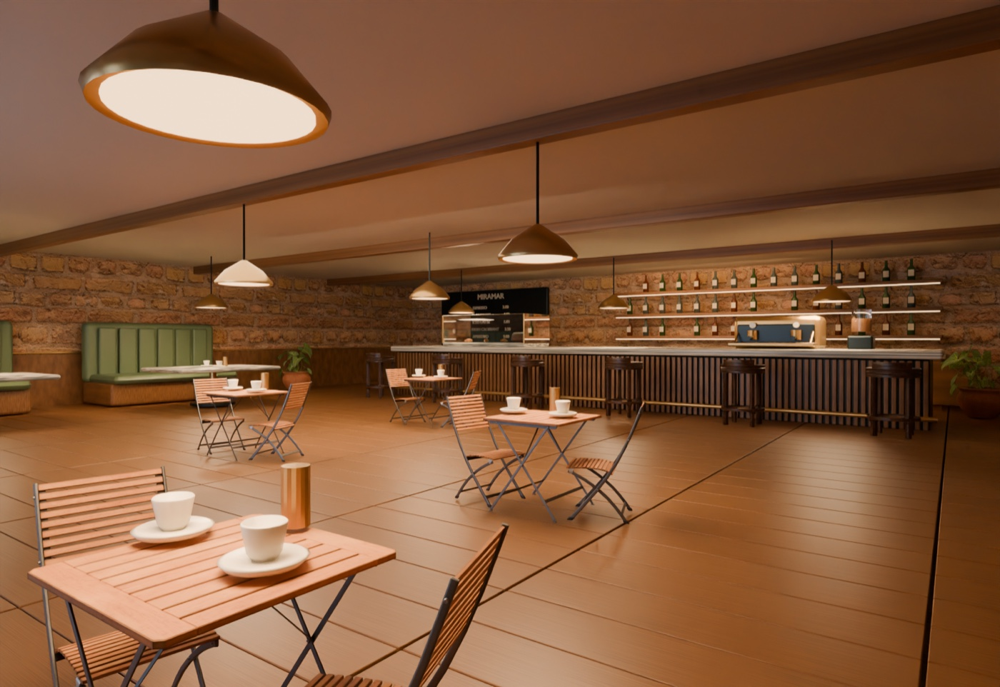
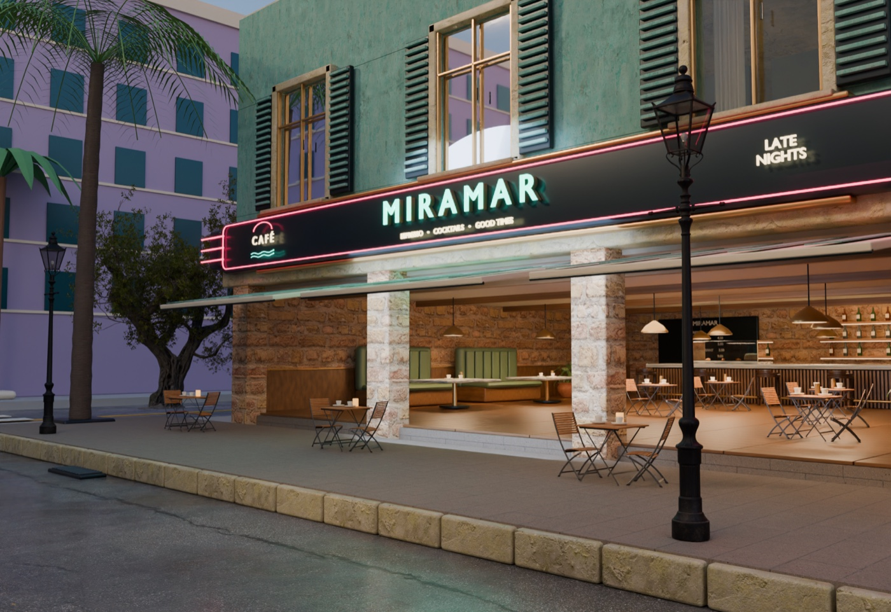

# Palm Royal

A tropical Art Deco coastal city, built in Blender and defined entirely by code.

There is no scene file to download here. The `.blend` files are outputs, not
sources: roughly 100 KB of Python regenerates 1.2 GB of geometry, and every
script pins its random seed, so a clean checkout rebuilds the same city rather
than a similar one.



## Quick start

```sh
make            # list the available targets
make all        # download the source assets, then build every scene
make verify     # confirm the rebuilt scenes match their reference counts
```

Blender is located automatically: on `PATH` first, then at the usual install
locations on macOS and Linux. `make check` reports which one is in use and
whether its version is supported. Point the build at a specific copy when you
keep several around, or when yours lives somewhere unusual:

```sh
make all BLENDER=/path/to/blender
```

## What is in here

Two projects share the same toolbox of procedural constructors.

**Palm Royal** is a standalone tropical street diorama: an Art Deco hotel, a
diner, a social club, ten palms, three stylized cars, street furniture and a
beach edge. 669 objects, no downloaded assets, no add-ons. One script builds it.

**Coastal City** is 280 × 250 meters of streets, nine blocks, six downtown
towers, a marina and a beach, built up over five stages. Each stage opens the
previous scene and enriches it, ending with a furnished, walkable cafe interior
lit by an original neon sign.

## The city

| | |
|---|---|
|  |  |
| The full city: nine blocks, a marina and a beach. | Palm Royal, the standalone diorama. |
|  |  |
| Inside Cafe Miramar, furnished and lit. | The original Art Deco neon sign. |

## The pipeline

```
download_assets.py       ->  assets/                       ~500 MB, CC0 and CC BY
                             |
build_city.py            ->  coastal-city.blend            11,971 objects
refine_city.py               (refines it in place)
                             |
build_showcase.py        ->  coastal-city-detailed.blend   12,895 objects
refine_showcase.py           (three passes over the same scene)
finalize_showcase.py
prepare_navigation.py
                             |
download_cafe_assets.py  ->  assets/                       cafe props
upgrade_windows_cafe.py  ->  coastal-city-interiors.blend  14,193 objects
                             |
upgrade_sign.py          ->  coastal-city-neon.blend       14,224 objects

build_world.py           ->  palm-royal.blend                 669 objects
                             (standalone, no assets needed)
```

`make` knows this graph. Asking for a later stage builds everything it needs
first, and skips what is already up to date.

## How reproducible it actually is

**Geometry is deterministic.** The four scripts that use randomness pin their
seeds (18, 41, 73 and 106). Delete a scene, rebuild it, and you get the same
object count, the same mesh count and the same vertex count, down to the last
one. `make verify` checks exactly that, comparing each scene against the
reference values in `scene-expectations.json`:

```
Verifying palm-royal.blend:
  cameras              2  ok
  collections          7  ok
  lights               9  ok
  materials           20  ok
  meshes             652  ok
  objects            669  ok
  vertices         10720  ok
```

**Renders are not bit-identical.** Cycles is a path tracer and its sampling
depends on how work is split across threads, so two renders of the same scene
differ in their noise. They match visually; they do not match by checksum, so
`make verify` checks the geometry and leaves the images alone.

## Requirements

- **Blender 5.1 or later**, tested against 5.1.2. The build refuses to start on
  anything older rather than failing halfway through with an unrelated error,
  and warns on Blender 6, which removes the `use_nodes` calls the scripts still
  make.
- **Python 3** for the two download scripts. They use only the standard library.
- **GNU make**, and a POSIX shell for it to run recipes in.
- **Network access** on the first build, for roughly 500 MB of source assets.
  Downloads are checksum-verified against the provider manifests and skipped
  when the files are already present.
- Time. The full pipeline renders several Cycles images along the way. On an
  Apple M2 Pro, `make diorama` takes about 15 seconds and `make city` about 45.
  The later stages are slower: they import the downloaded assets and render
  larger images.

### Platforms

Developed on macOS, and written to not depend on it. Every script derives its
paths from its own location and reads files as UTF-8 explicitly, so nothing
depends on the working directory or on the system locale.

On **Linux**, Blender is found on `PATH` or at `/usr/bin`, `/usr/local/bin`,
`/snap/bin` or `/opt/blender`. Nothing else should differ.

On **Windows**, run make from Git Bash or WSL and pass the executable, since the
recipes are shell commands:

```sh
make all BLENDER='/c/Program Files/Blender Foundation/Blender 5.1/blender.exe'
```

Reports from either platform are welcome: they are reasoned about here, not
tested on hardware.

## What is not in the repository

Generated `.blend` files, downloaded assets and the full-size renders the build
writes are all excluded, which keeps a checkout at a few megabytes instead of
2.8 GB and means a rebuild never leaves the working tree dirty. Only the asset
manifests are tracked, so the exact set and resolution of every source asset
stays pinned even though the binaries are not committed. The smaller images
under `docs/` are the documentation copies used above.

The scene guides cover each stage in detail: [CITY-GUIDE.md](CITY-GUIDE.md),
[DETAILED-GUIDE.md](DETAILED-GUIDE.md), [INTERIORS-GUIDE.md](INTERIORS-GUIDE.md).
The `logs/` directory holds the build logs from the original sessions.

## Viewport helpers

`open_cafe_interior.py` and `open_neon_sign.py` are not part of the build. They
open a finished scene and park the viewport somewhere worth looking at, and they
back up the current session first, so they only make sense against an
interactive Blender. Both refuse to run in background mode rather than
overwriting a backup with an empty scene.

`inspect_assets.py` prints the geometry of the downloaded assets without
executing anything embedded in them.

## Credits and licensing

The build scripts and documentation are MIT licensed, see [LICENSE](LICENSE).

Source assets keep their own licenses: CC0 models, textures and HDRI from
[Poly Haven](https://polyhaven.com/), and the CC BY 4.0 Car Concept by Eric
Chadwick from the Khronos glTF sample assets. Full attribution, including every
modification made to them, is in [ASSET-CREDITS.md](ASSET-CREDITS.md).

The city, its architecture and its signage are original work. No assets were
extracted from any commercial video game.
