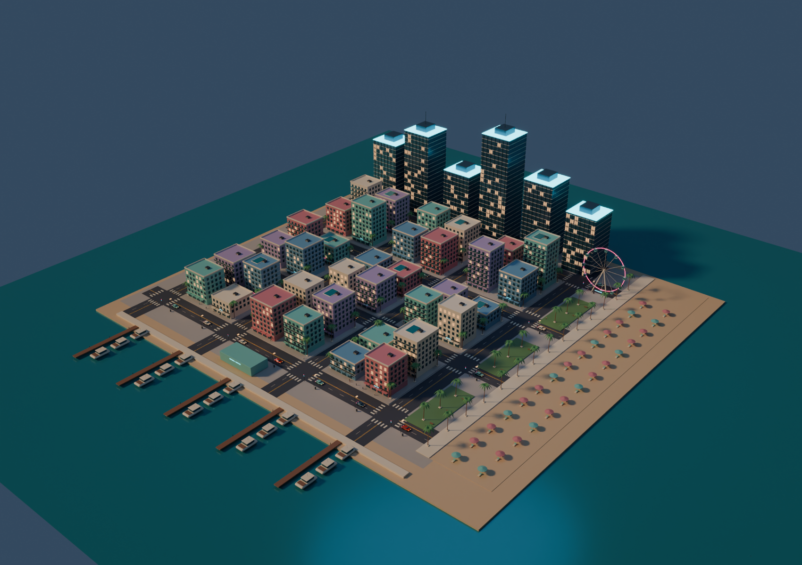
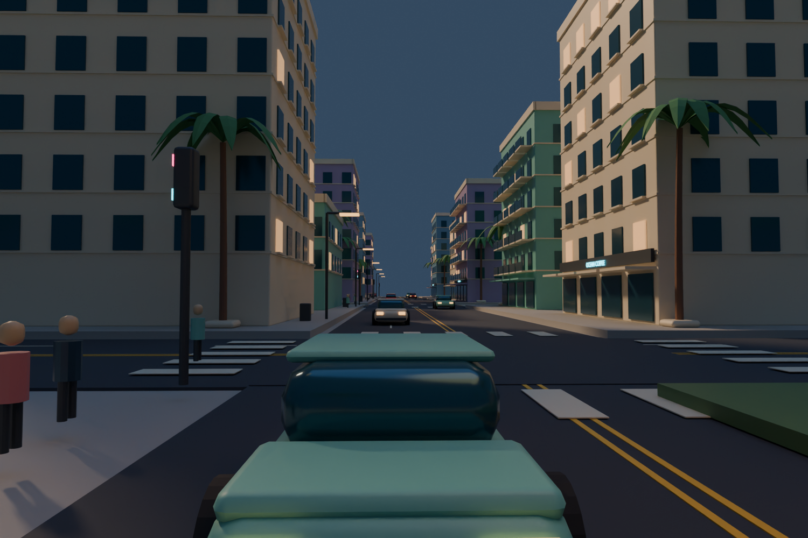
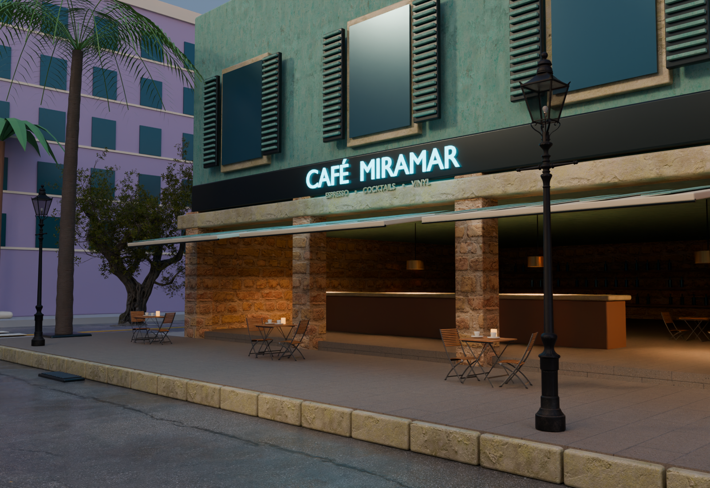

<p align="center">
  
</p>

# Palm Royal

**A GTA-inspired tropical city, modelled entirely in Blender by AI models writing Python.**

There is no manual modelling in this project. Every building, palm tree, kerb stone, neon tube and window frame exists because a language model wrote a Blender Python script that generates it. I ran the scripts, looked at what came out, said what was wrong, and the model rewrote the script. The repository is the record of that loop.

It is a personal experiment, run for the fun of finding out how far current models can push a 3D scene when the only interface they have is code.

[How it was built](docs/how-it-was-built.md) ·
[Asset credits](docs/asset-credits.md)

[](https://www.blender.org/)
[](LICENSE)

## The five stages

Each stage opens the scene the previous one saved and changes it, so the city grows in place rather than being regenerated from scratch. Every stage is one Python script and one deterministic random seed.

### 1. A street diorama

`build_world.py` builds a single Art Deco block on a floating slab: a hotel, a diner, a social club, ten palms, three cars and street furniture. 669 objects, all procedural, no external assets.


### 2. A city around it

`build_city.py` expands the block into a 280 × 250 metre city: nine districts, six downtown towers, four boulevards and four avenues, a marina with fifteen yachts, a beach, an observation wheel. The result is 11,928 objects sharing 1,090 unique meshes, which is what later makes it small enough to stream into a browser.

 

### 3. One block, at full quality

`build_showcase.py`, `refine_showcase.py` and `finalize_showcase.py` rebuild the original Palm Royal block with scanned PBR materials up to 4K, projecting cornices, shutters, balcony railings, individually modelled palm leaflets, wet asphalt, kerb stones and a drivable-looking concept car. The rest of the city stays stylized, which is the point: it is a quality study against a low-detail backdrop.



### 4. Real windows and real interiors

`upgrade_windows_cafe.py` replaces glass panels painted onto solid walls with actual openings: sills, mullions, curtains, room depth, furniture. Cafe Miramar gets a full interior with a marble bar, booths, an espresso machine and a pastry vitrine, visible from the street through the open front.

 

### 5. Neon

`upgrade_sign.py` builds an original Art Deco marquee for the cafe, with emissive tubing and a glow pass in the compositor.


## See it

**In the browser.** `viewer/` is a self-contained page that loads the stage 2 city as 3.7 MB of Draco-compressed geometry. Orbit it, or switch to walk mode and use W A S D to move down the boulevards. It is not hosted anywhere yet, so serve the folder and open it:

```sh
python3 -m http.server 8080 --directory viewer
```

**In Blender.** The finished city is `scenes/palm-royal-city.blend`. No Blender scene is tracked here: that file is 407 MB, almost all of it packed 4K textures, and GitHub caps a single file at 100 MB. Build it by running the pipeline below, then open it in Blender 5.1.2 or later. See [docs/city.md](docs/city.md) for the cameras and the walk navigation controls.

## Reproduce

The geometry is deterministic. The same scripts on the same Blender version produce the same scene, down to the position of each palm, because every stage seeds its random number generator explicitly.

A full rebuild from a clean clone takes about ten minutes and leaves 1.9 GB on disk, most of it the intermediate scenes. Measured on an Apple M2 Pro with 16 GB: fourteen seconds for stage 1, twenty-seven for stage 2, and between one and three minutes for each of the four Cycles stages.

```sh
BLENDER=/Applications/Blender.app/Contents/MacOS/Blender

# Stages 1 and 2: fully procedural, no downloads.
$BLENDER --background --factory-startup --python build_world.py
$BLENDER --background --factory-startup --python build_city.py

# Stage 3: fetch the CC0 source assets, then upgrade the central block.
python3 download_assets.py
$BLENDER --background --factory-startup --python build_showcase.py
$BLENDER --background --factory-startup --python refine_showcase.py
$BLENDER --background --factory-startup --python finalize_showcase.py

# Stages 4 and 5: interiors and neon.
python3 download_cafe_assets.py
$BLENDER --background --factory-startup --python upgrade_windows_cafe.py
$BLENDER --background --factory-startup --python upgrade_sign.py

# Optional: regenerate the web viewer geometry.
$BLENDER --background --factory-startup --python viewer/export_web.py
```

`download_assets.py` pulls roughly 500 MB from Poly Haven and verifies every file against the provider checksum. Only the manifests are tracked here, so the asset set stays reproducible without committing the binaries.

The pipeline leaves one scene per stage in `scenes/`. Only the last one, `palm-royal-city.blend`, is the finished city; the earlier four are intermediates that exist because each stage opens what the previous one saved, and they can be deleted once the run completes.

The renders are a shade less reproducible than the scenes. The two untextured stages come back pixel for pixel identical, but Cycles accumulates samples in thread completion order and the denoiser inherits that, so the textured stages land within a couple of levels out of 255 rather than byte for byte. The difference is invisible and it is noise, not content.

## What this is not

- Not a game. There is no gameplay, no physics, no collision, no AI traffic. The walk mode in the web viewer glides through walls on purpose.
- Not a full-city asset pass. Only the central block got the high-quality treatment. Zoom into anything else and it is deliberately simple geometry.
- Not built from ripped assets. Nothing here comes from any commercial video game. The architecture is original, the third-party props are CC0 from Poly Haven, and the concept car is CC BY. Full sourcing in [docs/asset-credits.md](docs/asset-credits.md).
- Not affiliated with Rockstar Games. "GTA-inspired" describes a visual mood: sun-bleached Art Deco, palms and neon.

## Layout

```
scenes/     the finished city, once the pipeline has built it
renders/    the Cycles output of each stage
viewer/     the three.js browser viewer and its glTF export script
docs/       stage guides, the build story, asset credits
logs/       build logs from the original runs
assets/     manifests for the CC0 assets, fetched at build time
*.py        the pipeline itself, run in the order given above
```

## Documentation

- [How it was built](docs/how-it-was-built.md): the models, the pipeline, and the quirks the workflow left behind.
- [The coastal city](docs/city.md): scale, districts, cameras, navigation.
- [The detailed block](docs/detailed-block.md): the quality study and its sources.
- [Interiors and windows](docs/interiors.md): real openings, glazing, the cafe interior.
- [Asset credits](docs/asset-credits.md): every third-party asset, author and licence.

## Stack

Blender 5.1.2 and its Python API, Cycles for rendering, Poly Haven for CC0 scanned materials and props, three.js for the web viewer.

## Licence

Project code and original geometry: [MIT](LICENSE). Third-party assets keep their own licences, listed in [docs/asset-credits.md](docs/asset-credits.md).
